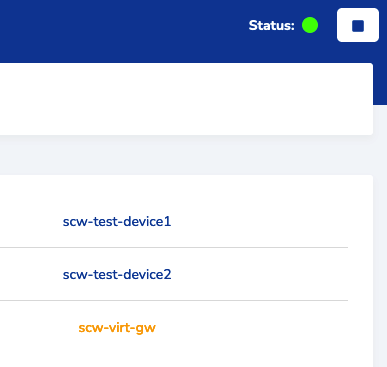
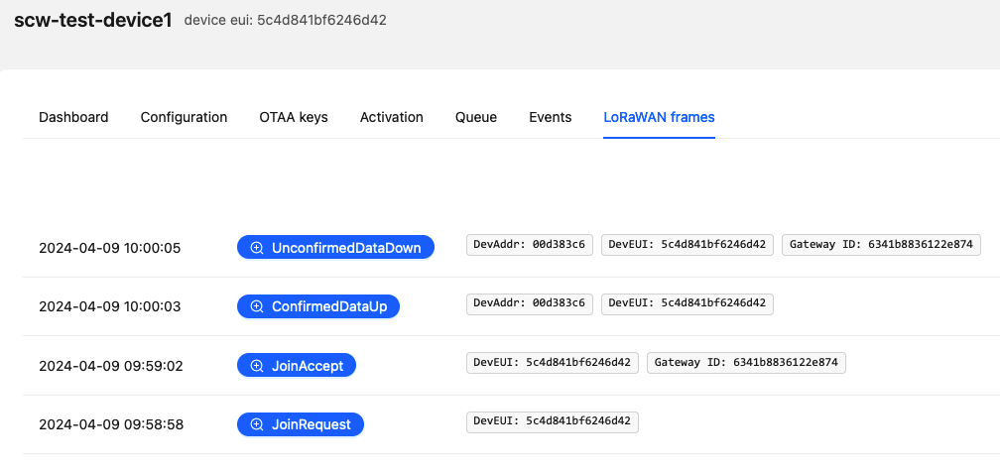

lwnsimulator
============

LoraWan simulator based on [this repository](https://github.com/UniCT-ARSLab/LWN-Simulator), with up to date dependencies and pre-configured devices and virtual gateway for demo.

| Device           | ID               | OTAA app key                        |
|------------------|------------------|-------------------------------------|
| scw-test-device1 | 5c4d841bf6246d42 | 7a5cf4f81df578b27641d8305516aaa6    |
| scw-test-device2 | b602655e35690b7b | 4c98ea5a445c805f2579488cac7878ee    |
| scw-virt-gw      | 6341b8836122e874 | Gateway bridge via "localhost:1700" |



Usage
-----

Run image in docker, go to `http://localhost:8000` and check and modify configuration. This need to be connected to a gateway bridge like [Chirpstack](https://www.chirpstack.io/) after configuration of the gateway and devices.

You can pass as argument to the container a gateway bridge hostname which will replace `localhost` in the configuration (check `entrypoint.sh`).

```
docker run -d -p 8000:8000 --name lwnsimulator ghcr.io/n-arno/lwnsimulator:latest my-gw-bridge
```

Example
-------

A modified `docker-compose.yml` from [this example](https://github.com/chirpstack/chirpstack-docker) is provided. This will start Chirpstack with the same devices already created (via the sql dump provided).

```
docker compose up -d
```

You can then go to `http://localhost:8000` to start the simulation and to `http://localhost:8080` to check on the devices joining.


